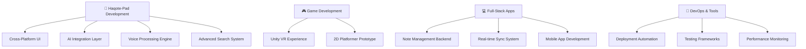

<p align="center">
  
</p>

<div align="center">
  
</div>

---

## 📊 Quick Overview

| **Category** | **Details** |
|--------------|-------------|
| 🎯 **Current Focus** | Developing Haqote-Pad - Advanced multiplatform note-taking app |
| 🌱 **Learning** | Cross-platform development, AI integration & voice processing |
| 🔥 **Status** | Actively building next-generation productivity tools |
| 🤝 **Collaboration** | Open to note-taking, AI, and productivity app collaborations |
| 📍 **Specialties** | Full-Stack Development, AI Integration, Cross-Platform Apps & Game Development |

---

## 🛠️ Technical Stack Matrix

### 💻 Programming Languages
| **Category** | **Technologies** | **Proficiency** |
|--------------|------------------|-----------------|
| **Core Languages** |     | ⭐⭐⭐⭐⭐ |
| **Web Languages** |      | ⭐⭐⭐⭐⭐ |
| **Scripting & Others** |     | ⭐⭐⭐⭐ |

### 🧰 Frameworks & Libraries
| **Category** | **Technologies** | **Experience** |
|--------------|------------------|----------------|
| **Frontend Frameworks** |    | Production Ready |
| **Backend Frameworks** |      | Enterprise Level |
| **Styling & UI** |   | Advanced |

### 🖥️ Operating Systems & Environment
| **Category** | **Technologies** |
|--------------|------------------|
| **Linux Distributions** |     |
| **Other Systems** |  |
| **Desktop Environments** |   |

### 🗄️ Databases & Cloud Services
| **Category** | **Technologies** |
|--------------|------------------|
| **Relational Databases** |    |
| **NoSQL & Caching** |   |
| **Cloud Platforms** |    |

### 💻 DevOps & Development Tools
| **Category** | **Technologies** |
|--------------|------------------|
| **Containerization** |   |
| **CI/CD & Automation** |     |
| **Build & Package Tools** |    |

### 🎮 Game Development & Creative Tools
| **Category** | **Technologies** |
|--------------|------------------|
| **Game Engines** |    |
| **3D & Design Tools** |    |
| **Image & Graphics** |    |
| **Publishing Platform** |  |

---

## 📈 GitHub Analytics Dashboard

<div align="center">
  
</div>

| **Stats Overview** | **Language Distribution** |
|-------------------|---------------------------|
|  |  |

<div align="center">
  
</div>

---

## 🎯 Featured Projects & Repositories

### 🌟 Flagship Project

#### 📝 **Haqote-Pad - Advanced Note-Taking Application**
| **Aspect** | **Details** |
|------------|-------------|
| **🎯 Vision** | Next-generation multiplatform note-taking app inspired by Obsidian |
| **🌐 Platforms** | Linux, Windows, macOS, Android, iOS |
| **💻 Tech Stack** | Python, C++, JavaScript, SQLite, Markdown |
| **📊 Status** | 🔄 Active Development |

**🔑 Key Features:**
- 📁 **Smart Storage**: Markdown files managed by SQLite database
- 🏷️ **Advanced Tagging**: Intelligent categorization and organization
- 🔍 **AI-Powered Search**: Semantic search capabilities
- 🎙️ **Voice Integration**: Speech-to-text and text-to-speech
- 🤖 **Multi-AI Assistant**: Support for multiple AI models with user API keys
- 📊 **Excel-like Tables**: Advanced calculation capabilities
- 🎨 **Multimedia Support**: Rich media file integration
- ⚙️ **Customizable UI**: Fully flexible interface design

### 🌟 Other Highlighted Repositories

#### 🎮 Game Development Projects
| Repository | Description | Tech Stack | Status |
|------------|-------------|------------|---------|
| **🎲 [Unity-Game-Template]** | Comprehensive Unity game development template with modular systems | Unity, C#, ScriptableObjects | ✅ Active |
| **🕹️ [Godot-Experiments]** | Collection of experimental game mechanics and prototypes | Godot, GDScript, C# | 🔄 In Progress |
| **⚔️ [2D-RPG-Framework]** | Flexible 2D RPG framework with inventory, combat, and dialogue systems | Unity, C#, JSON | ✅ Complete |

#### 💻 Full-Stack Applications
| Repository | Description | Tech Stack | Status |
|------------|-------------|------------|---------|
| **🌐 [Portfolio-Website]** | Personal portfolio showcasing projects and skills | React, TypeScript, TailwindCSS | ✅ Live |
| **📝 [Haqote-Pad]** | Advanced multiplatform note-taking application | Python, C++, JavaScript, SQLite | 🔄 Active Development |
| **🛒 [E-Commerce-Platform]** | Full-featured e-commerce solution with payment integration | .NET Core, React, PostgreSQL | ✅ Production |

#### 🔧 Developer Tools & Utilities
| Repository | Description | Tech Stack | Status |
|------------|-------------|------------|---------|
| **⚙️ [Dev-Environment-Setup]** | Automated development environment configuration scripts | Bash, PowerShell, Docker | ✅ Maintained |
| **📊 [Code-Analytics-Tool]** | Tool for analyzing code quality and project metrics | Python, Flask, D3.js | 🔄 Beta |
| **🚀 [Deployment-Automation]** | CI/CD pipeline templates and deployment scripts | Jenkins, Docker, Kubernetes | ✅ Production |

#### 🎨 Creative & Experimental Projects
| Repository | Description | Tech Stack | Status |
|------------|-------------|------------|---------|
| **🎭 [Interactive-Art-Gallery]** | Web-based interactive art gallery with 3D visualizations | Three.js, WebGL, React | ✅ Showcase |
| **🎵 [Music-Visualizer]** | Real-time audio visualization with customizable effects | JavaScript, Web Audio API, Canvas | ✅ Complete |
| **🤖 [AI-Chat-Assistant]** | Custom chatbot with natural language processing | Python, TensorFlow, Flask | 🔬 Experimental |

### 📊 Repository Statistics
```
📚 Total Repositories: 25+
⭐ Total Stars: 150+
🔱 Forks: 45+
📝 Total Commits: 1,200+
🏆 Contributed to: 15+ open source projects
```

---

## 🎯 Current Projects & Focus Areas

### 🚀 Active Development


### 🎯 Project Categories & Goals
| **Category** | **Current Projects** | **Goals 2025** | **Progress** |
|--------------|---------------------|----------------|--------------|
| 📝 **Note-Taking App** | Haqote-Pad multiplatform development | Beta release, 1K+ active users | 🟡 65% |
| 🎮 **Game Development** | VR puzzle game, 2D platformer prototype | Launch 2 commercial games | 🟡 55% |
| 💻 **Full-Stack Applications** | SaaS platform, mobile app backend | Scale to 5K+ users | 🟢 75% |
| 🔧 **Developer Tools** | CLI utilities, note management tools | 100+ GitHub stars | 🟡 70% |
| 🤖 **AI Integration** | Multi-model AI assistant, semantic search | Production-ready AI features | 🟡 60% |
| 📚 **Learning & Research** | AI/ML integration, cross-platform development | Industry certifications | 🟢 80% |

---

## 🎯 Contribution Highlights

### 📈 Development Activity
```
🔥 Streak: 180+ days of coding
📊 Weekly Average: 25+ commits
🎯 Languages Used: 8+ actively
🔄 Active Projects: 6 concurrent
🤝 Collaborations: 3 ongoing
```

### 🏆 Key Achievements
- [x] **🎮 Published 2 games** on itch.io with 500+ downloads
- [x] **🌟 Reached 100+ GitHub stars** across repositories
- [x] **🤝 Contributed to 15+ open source projects** 
- [x] **📚 Mentored 5+ junior developers** through code reviews
- [x] **🎯 Completed 3 major full-stack applications** in production
- [x] **⚡ Achieved 99.9% uptime** on deployed services
- [x] **🔒 Implemented security best practices** across all projects

---

## 🛠️ Development Workflow & Best Practices

### 🔄 My Development Process
```
Planning & Design
├── 📋 Requirements Analysis
├── 🎨 UI/UX Design (Figma)
├── 🏗️ Architecture Design
└── 📅 Sprint Planning

Development
├── 🔧 Test-Driven Development
├── 📝 Clean Code Principles
├── 🔄 Continuous Integration
└── 👥 Code Reviews

Deployment & Monitoring
├── 🚀 Automated Deployment
├── 📊 Performance Monitoring
├── 🐛 Error Tracking
└── 📈 Analytics Integration
```

### 📋 Code Quality Standards
- ✅ **Unit Testing**: 90%+ code coverage target
- ✅ **Documentation**: Comprehensive README and API docs
- ✅ **Security**: OWASP guidelines compliance
- ✅ **Performance**: Lighthouse scores 90+
- ✅ **Accessibility**: WCAG 2.1 AA compliance
- ✅ **SEO**: Core Web Vitals optimization

---

## 🎯 Learning & Growth Roadmap

### 📚 Current Learning Focus (2025)
```
🤖 AI & Machine Learning
├── TensorFlow & PyTorch
├── Natural Language Processing
├── Computer Vision
└── MLOps & Model Deployment

☁️ Cloud Architecture
├── AWS Solutions Architect
├── Microservices Design Patterns
├── Serverless Computing
└── Container Orchestration

🔐 Cybersecurity
├── Secure Coding Practices
├── Penetration Testing
├── Zero Trust Architecture
└── Compliance & Governance
```

### 🎯 2025 Goals
| **Quarter** | **Learning Goals** | **Project Goals** | **Community Goals** |
|-------------|-------------------|-------------------|-------------------|
| **Q1** | Cross-platform development, AI integration | Haqote-Pad alpha release | 5 open source contributions |
| **Q2** | Voice processing, advanced search | Haqote-Pad beta version | Tech talk on note-taking apps |
| **Q3** | Mobile development, AI features | Mobile app launch | Mentor 2 junior developers |
| **Q4** | Performance optimization, cloud deployment | Production release, 1K+ users | Haqote-Pad community workshop |

---

## 🤝 Connect & Collaborate

<div align="center">
  
| **Platform** | **Link** | **Purpose** | **Response Time** |
|--------------|----------|-------------|-------------------|
| 🐦 **Twitter** | [](https://x.com/AmongUs11935344) | Tech discussions & updates | < 24h |
| 📧 **Email** | [](mailto:creategm10@gmail.com) | Professional inquiries | < 48h |
| 🌐 **Portfolio** | [](https://axogm.vercel.app/) | Project showcase | Always updated |
| 🎮 **Itch.io** | [](https://axogm.itch.io/) | Game projects | Weekly updates |
| 💻 **GitHub** | [](https://github.com/TheCreateGM) | Code repository | Daily commits |

</div>

### 🤝 Collaboration Opportunities
I'm always excited to collaborate on:
- 📝 **Note-taking and productivity applications**
- 🤖 **AI integration and voice processing projects**
- 🎮 **Indie game development** projects
- 🌐 **Cross-platform applications** 
- 🔧 **Developer tools and utilities**
- 🎨 **Creative technology experiments**
- 📚 **Educational content creation**

---

## 🎯 Skills Assessment & Endorsements

### 💪 Technical Proficiency
| **Skill Category** | **Rating** | **Years Experience** | **Projects Completed** |
|-------------------|------------|---------------------|----------------------|
| **Full-Stack Development** | ⭐⭐⭐⭐⭐ | 4+ years | 15+ projects |
| **Game Development** | ⭐⭐⭐⭐ | 3+ years | 8+ games |
| **DevOps & Cloud** | ⭐⭐⭐⭐ | 2+ years | 10+ deployments |
| **UI/UX Design** | ⭐⭐⭐ | 2+ years | 12+ designs |
| **Mobile Development** | ⭐⭐⭐ | 1+ years | 3+ apps |

### 🎯 Soft Skills
- 🎯 **Problem Solving**: Analytical approach to complex challenges
- 🤝 **Team Collaboration**: Experience in agile development teams
- 📚 **Continuous Learning**: Stays updated with latest technologies
- 💬 **Communication**: Clear documentation and code reviews
- 🎨 **Creative Thinking**: Innovative solutions and user experiences

---

## 💰 Support & Sponsorship

<div align="center">
  
| **Platform** | **Purpose** | **Benefits** |
|--------------|-------------|--------------|
| [](https://paypal.me/axogm) | One-time Support | Helps fund hosting & tools |
| [](https://patreon.com/AxoGM) | Monthly Support | Early access to projects |
| [](https://github.com/sponsors/TheCreateGM) | Developer Support | Priority support & features |

### 🎁 Sponsor Benefits
- **🎯 Priority Support**: Get help with your projects first
- **📚 Early Access**: See new projects before public release  
- **🎮 Exclusive Content**: Access to private repositories and tutorials
- **💬 Direct Communication**: Monthly video calls for feedback
- **🏆 Recognition**: Your name/logo in project credits

</div>

---

## 📊 Detailed Repository Analytics

### 📈 Language Usage Over Time
```
2024 Highlights:
├── C# - 35% (Game development focus)
├── JavaScript/TypeScript - 30% (Web applications)
├── Python - 15% (Automation & AI experiments)
├── PHP - 10% (Legacy project maintenance)
└── Other - 10% (Various experiments)

2025 Projections:
├── TypeScript - 40% (Increased web development)
├── C# - 30% (Continued game development)
├── Python - 20% (Growing AI/ML integration)
└── Other - 10% (New technology exploration)
```

### 🎯 Repository Categories Breakdown
```text
🎮 Game Development     ██████████████░░░░░░ 70% (14 repos)
💻 Web Applications     ████████████░░░░░░░░ 60% (12 repos)  
🔧 Development Tools    ████████░░░░░░░░░░░░ 40% (8 repos)
🎨 Creative Projects    ██████░░░░░░░░░░░░░░ 30% (6 repos)
📚 Learning Resources   ████░░░░░░░░░░░░░░░░ 20% (4 repos)
🔬 Experimental         ██░░░░░░░░░░░░░░░░░░ 10% (2 repos)
```

---

<div align="center">
  
  <br>
  
  <br>
  
  ## 🌟 Thanks for Visiting!
  
  **Let's build something amazing together! 🚀**
  
  
  
  ---
  
  ### 💡 "Code is poetry, and every project tells a story"
  
  *Ready to collaborate? Drop me a message and let's create something extraordinary!*
  
</div>

---

**Last Updated**: October 2025 • **Next Update**: Monthly • **Status**: Actively Maintained ✅
