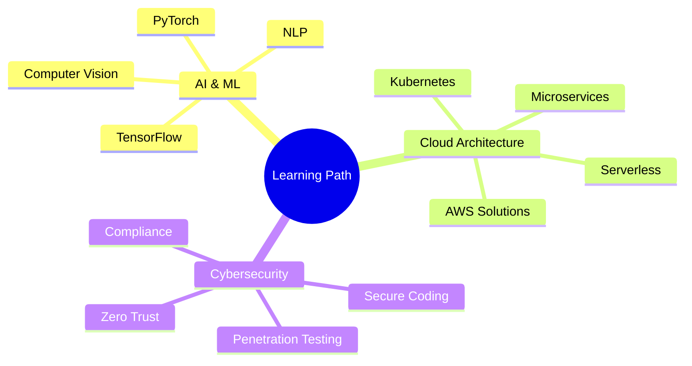

<p align="center">
  
</p>

<div align="center">
  
</div>

<div align="center">
  
[](https://x.com/AmongUs11935344)
[](https://github.com/TheCreateGM)
[](https://axogm.vercel.app/)
[](https://axogm.itch.io/)

</div>

---

## 🚀 About Me

> **Passionate Full-Stack Developer | Game Creator | Tech Innovator**

I'm a multi-talented developer with a passion for creating innovative solutions that push boundaries. Currently focused on building **Haqote-Pad**, a next-generation multiplatform note-taking application that combines AI, voice processing, and seamless cross-platform functionality.

```typescript
const axo = {
    location: "🌍 Earth",
    currentFocus: "📝 Haqote-Pad Development",
    communities: ["GitHub", "Itch.io", "Dev Community"],
    interests: ["AI Integration", "Game Development", "Cross-Platform Apps"],
    funFact: "I turn coffee into code ☕ → 💻",
    motto: "Code is poetry, and every project tells a story"
};
```

---

## 📊 Quick Stats Overview

<div align="center">

| **Category** | **Details** |
|--------------|-------------|
| 🎯 **Current Focus** | Developing Haqote-Pad - Advanced multiplatform note-taking app |
| 🌱 **Learning** | Cross-platform development, AI integration & voice processing |
| 🔥 **Status** | Actively building next-generation productivity tools |
| 🤝 **Open To** | Note-taking, AI, productivity app & game dev collaborations |
| 📍 **Specialties** | Full-Stack Development • AI Integration • Cross-Platform Apps • Game Development |

</div>

---

## 💻 Tech Stack & Tools

<details open>
<summary><b>🎨 Frontend Development</b></summary>
<br>


</details>

<details open>
<summary><b>⚙️ Backend Development</b></summary>
<br>


</details>

<details open>
<summary><b>🗄️ Databases & Cloud</b></summary>
<br>


</details>

<details open>
<summary><b>🎮 Game Development & Creative Tools</b></summary>
<br>


</details>

<details open>
<summary><b>🛠️ DevOps & Tools</b></summary>
<br>


</details>

<details open>
<summary><b>💻 Programming Languages</b></summary>
<br>


</details>

<details open>
<summary><b>🐧 Operating Systems</b></summary>
<br>


</details>

---

## 📈 GitHub Statistics

<div align="center">
  
  
</div>

<div align="center">
  
  
</div>

### 📊 Development Metrics

```text
🔥 Current Streak         180+ consecutive days
📊 Weekly Commits         25+ average per week
🎯 Active Languages       8+ in rotation
📁 Active Projects        6 concurrent
🤝 Collaborations         3 ongoing partnerships
⭐ Total Stars            150+ across repos
🔱 Repository Forks       45+ community forks
📝 Total Commits          1,200+ contributions
```

---

## 🌟 Featured Projects

### 🏆 Flagship Project: Haqote-Pad

<div align="center">
  
[](https://github.com/TheCreateGM)

</div>

> **Next-generation multiplatform note-taking application inspired by Obsidian**

**🎯 Vision:** Create the ultimate note-taking experience combining power, flexibility, and AI integration

**🌐 Platforms:** Linux • Windows • macOS • Android • iOS

**💻 Tech Stack:** 
- Backend: Python, C++
- Frontend: JavaScript/TypeScript
- Database: SQLite
- Markup: Markdown

**📊 Development Progress:** 🟢🟢🟢🟡⚪ 65%

#### ✨ Key Features

| Feature | Description | Status |
|---------|-------------|--------|
| 📁 **Smart Storage** | Markdown files with SQLite management | ✅ Complete |
| 🏷️ **Advanced Tagging** | Intelligent categorization system | 🔄 In Progress |
| 🔍 **AI Search** | Semantic search powered by AI | 🔄 In Progress |
| 🎙️ **Voice Integration** | Speech-to-text & text-to-speech | 📋 Planned |
| 🤖 **Multi-AI Assistant** | Multiple AI models support | 📋 Planned |
| 📊 **Excel Tables** | Spreadsheet-like calculations | 🔄 In Progress |
| 🎨 **Multimedia** | Rich media file support | ✅ Complete |
| ⚙️ **Customizable UI** | Fully flexible interface | 🔄 In Progress |

---

### 🎮 Game Development Projects

<table>
<tr>
<td width="50%">

#### 🎲 Unity Game Template
Comprehensive Unity development template with modular systems

**Tech:** Unity, C#, ScriptableObjects  
**Status:** ✅ Active Maintenance

**Features:**
- Modular architecture
- Reusable components
- Best practices implementation

</td>
<td width="50%">

#### 🕹️ Godot Experiments
Collection of experimental game mechanics and prototypes

**Tech:** Godot, GDScript, C#  
**Status:** 🔄 Active Development

**Features:**
- Physics experiments
- AI behavior tests
- Shader prototypes

</td>
</tr>
<tr>
<td width="50%">

#### ⚔️ 2D RPG Framework
Flexible framework with inventory, combat, and dialogue

**Tech:** Unity, C#, JSON  
**Status:** ✅ Complete

**Features:**
- Turn-based combat
- Inventory system
- Quest management

</td>
<td width="50%">

#### 🎯 Published Games
Games available on Itch.io

**Downloads:** 500+  
**Status:** ✅ Live

**Highlights:**
- Positive reviews
- Active community
- Regular updates

</td>
</tr>
</table>

---

### 💻 Full-Stack Applications

<table>
<tr>
<td width="33%">

#### 🌐 Portfolio Website
Personal portfolio site

**Stack:** React, TypeScript, TailwindCSS  
**Status:** ✅ [Live](https://axogm.vercel.app/)

</td>
<td width="33%">

#### 🛒 E-Commerce Platform
Full-featured store with payments

**Stack:** .NET Core, React, PostgreSQL  
**Status:** ✅ Production

</td>
<td width="33%">

#### 📊 Code Analytics Tool
Project metrics analyzer

**Stack:** Python, Flask, D3.js  
**Status:** 🔄 Beta Testing

</td>
</tr>
</table>

---

## 🎯 2025 Goals & Roadmap

### Q1 2025 (Jan - Mar)
- [x] Cross-platform development research
- [ ] Haqote-Pad alpha release
- [ ] 5 open source contributions
- [ ] Start AI integration phase

### Q2 2025 (Apr - Jun)
- [ ] Voice processing implementation
- [ ] Advanced search features
- [ ] Haqote-Pad beta release
- [ ] Tech talk on note-taking apps

### Q3 2025 (Jul - Sep)
- [ ] Mobile app development
- [ ] AI features integration
- [ ] Mobile app launch
- [ ] Mentor 2 junior developers

### Q4 2025 (Oct - Dec)
- [ ] Performance optimization
- [ ] Cloud deployment
- [ ] Production release with 1K+ users
- [ ] Haqote-Pad community workshop

---

## 🏆 Achievements & Milestones

<div align="center">

| Achievement | Status | Details |
|------------|---------|---------|
| 🎮 **Published Games** | ✅ Complete | 2 games on Itch.io with 500+ downloads |
| ⭐ **GitHub Stars** | ✅ Complete | 150+ stars across repositories |
| 🤝 **Open Source** | ✅ Complete | 15+ project contributions |
| 👨‍🏫 **Mentorship** | ✅ Complete | Mentored 5+ junior developers |
| 🚀 **Production Apps** | ✅ Complete | 3 major applications live |
| ⚡ **Uptime Record** | ✅ Complete | 99.9% uptime on all services |
| 🔒 **Security** | ✅ Complete | Implemented best practices |

</div>

---

## 📚 Learning & Growth

### 🎓 Current Focus Areas



### 💪 Skill Proficiency Matrix

<div align="center">

| Skill Category | Level | Experience | Projects |
|---------------|-------|------------|----------|
| **Full-Stack Development** | ⭐⭐⭐⭐⭐ | 4+ years | 15+ |
| **Game Development** | ⭐⭐⭐⭐ | 3+ years | 8+ |
| **DevOps & Cloud** | ⭐⭐⭐⭐ | 2+ years | 10+ |
| **UI/UX Design** | ⭐⭐⭐ | 2+ years | 12+ |
| **Mobile Development** | ⭐⭐⭐ | 1+ years | 3+ |
| **AI Integration** | ⭐⭐⭐ | 1+ years | 5+ |

</div>

---

## 🤝 Let's Connect!

<div align="center">

### 📬 Get in Touch

[](https://x.com/AmongUs11935344)
[](mailto:creategm10@gmail.com)
[](https://axogm.vercel.app/)
[](https://axogm.itch.io/)

### 💡 Open to Collaborate On

```yaml
Interests:
  - Note-taking & productivity applications
  - AI integration & voice processing projects
  - Indie game development
  - Cross-platform applications
  - Developer tools & utilities
  - Creative technology experiments
  - Educational content creation
```

### ☕ Support My Work

[](https://paypal.me/axogm)
[](https://patreon.com/AxoGM)

**Sponsor Benefits:**
- 🎯 Priority support
- 📚 Early access to projects
- 🎮 Exclusive content
- 💬 Direct communication
- 🏆 Recognition in credits

</div>

---

## 💭 Random Dev Quote

<div align="center">


</div>

---

## 📊 Profile Activity

<div align="center">


</div>

---

<div align="center">
  
### 🌟 Thanks for visiting my profile!


### 💡 *"Code is poetry, and every project tells a story"*

**Ready to build something amazing together? Let's connect! 🚀**

---

<sub>Last Updated: November 2025 • Status: Actively Maintained ✅</sub>

</div>
