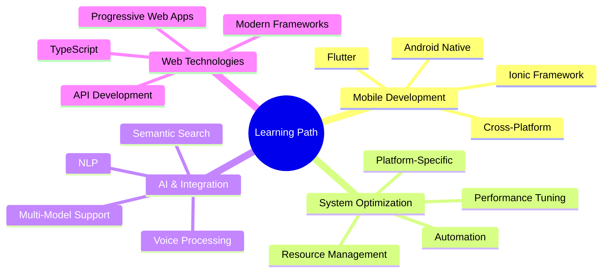

<p align="center">
  
</p>

<div align="center">
  
</div>

<div align="center">
  
[](https://x.com/AmongUs11935344)
[](https://github.com/TheCreateGM)
[](https://axogm.vercel.app/)
[](https://thecreategm.github.io/)
[](https://axogm.itch.io/)

</div>

---

## 🚀 About Me

> **Passionate Full-Stack Developer | System Optimizer | Tech Innovator**

I'm a multi-talented developer with a passion for creating innovative solutions and optimizing systems. Currently focused on developing **performance optimization tools** for various platforms, while also creating high-quality **3D assets** for game development.

```typescript
const axo = {
    location: "🌍 Earth",
    currentFocus: "⚡ System Optimization & 3D Modeling",
    communities: ["GitHub", "Itch.io", "Dev Community"],
    interests: ["AI Integration", "System Optimization", "Cross-Platform Apps", "Mobile Development"],
    funFact: "I turn coffee into optimized code ☕ → 💻",
    motto: "Code is poetry, and every project tells a story"
};
```

---

## 📊 Quick Stats Overview

<div align="center">

| **Category** | **Details** |
|--------------|-------------|
| 🎯 **Current Focus** | System optimization tools & 3D Game Assets |
| 🌱 **Learning** | Cross-platform development, AI integration & mobile development |
| 🔥 **Status** | Actively building productivity tools & optimizers |
| 🤝 **Open To** | System optimization, 3D modeling & mobile app collaborations |
| 📍 **Specialties** | Full-Stack Development • System Optimization • Cross-Platform Apps • Mobile Development |

</div>

---

## 💻 Tech Stack & Tools

<details open>
<summary><b>🎨 Core Languages</b></summary>
<br>


</details>

<details open>
<summary><b>⚙️ Frameworks & Backend</b></summary>
<br>


</details>

<details open>
<summary><b>📱 Mobile Development</b></summary>
<br>


</details>

<details open>
<summary><b>🗄️ Databases & Cloud</b></summary>
<br>


</details>

<details open>
<summary><b>🎮 Game Development & Creative Tools</b></summary>
<br>


</details>

<details open>
<summary><b>🛠️ DevOps & Tools</b></summary>
<br>


</details>

<details open>
<summary><b>🐧 Operating Systems & Environments</b></summary>
<br>


</details>

---

## 📈 GitHub Statistics

<div align="center">
  
  
</div>

<div align="center">
  
  
</div>

### 📊 Development Metrics

```text
🔥 Current Streak         180+ consecutive days
📊 Weekly Commits         25+ average per week
🎯 Active Languages       12+ in rotation
📁 Active Projects        8+ concurrent
🤝 Collaborations         3 ongoing partnerships
⭐ Total Stars            150+ across repos
🔱 Repository Forks       45+ community forks
📝 Total Commits          1,200+ contributions
📦 Total Repositories     50+ public repos
```

---

## 🌟 Featured Projects

### 🎨 3D Assets & Game Dev

<div align="center">
  
[](https://axogm.itch.io/)

</div>

> **High-quality 3D weapon models and game assets**

**AVAILABLE ASSETS:**
*   **AK 9x39 CQBR**: Custom and standard variants
*   **ACR Bushmaster**: Modular rifle system
*   **AA-12**: Automatic shotgun with custom attachments
*   **A I AWSM**: Sniper rifle system
*   **Classic Rifles**: 1866 Yellowboy & 1860 Henry

[View all assets on Itch.io](https://axogm.itch.io/)

---

### 🔧 System Optimization Tools

<table>
<tr>
<td width="50%">

#### 🍎 macOS Optimizer
Comprehensive optimization tool for macOS systems

**Tech:** Shell Script  
**Status:** ✅ Active (Updated Dec 2025)  
**Repo:** [optimize-macos](https://github.com/TheCreateGM/optimize-macos)

**Features:**
- Easy to use command-line tool
- System performance enhancement
- Resource optimization

</td>
<td width="50%">

#### 💻 Windows 11 Optimizer
Performance optimization for Windows 11

**Tech:** Batch Script  
**Status:** ✅ Active (Updated Dec 2025)  
**Repo:** [optimize-win11](https://github.com/TheCreateGM/optimize-win11)

**Features:**
- System performance tuning
- Privacy settings optimization
- Startup management

</td>
</tr>
<tr>
<td width="50%">

#### 📱 Android Optimizers
Device-specific optimization tools

**Devices:** Samsung A34, Lenovo Tab M10 Gen 3  
**Status:** ✅ Active (Updated Nov 2025)  
**Tech:** Shell Script (ADB)

**Features:**
- Debloating utilities
- Performance optimization
- Battery life improvement

</td>
<td width="50%">

#### 🎨 Blender Optimizer
Performance enhancement for Blender 3D

**Tech:** Shell Script  
**Status:** ✅ Complete  
**License:** MIT

**Features:**
- Render optimization
- Memory management
- Workflow enhancement

</td>
</tr>
</table>

---

### 💻 Full-Stack Applications

<table>
<tr>
<td width="33%">

#### 🔬 LabTech
Geotechnical engineering lab app

**Stack:** Ionic, Angular, TypeScript  
**Status:** ✅ Active (Updated Nov 2025)

**Purpose:** Comprehensive mobile app for geotechnical lab tests

</td>
<td width="33%">

#### 🌐 Portfolio v2
Enhanced portfolio site

**Stack:** TypeScript, React  
**Status:** ✅ Active (Updated Nov 2025)  
**Stars:** ⭐ 1

</td>
<td width="33%">

#### 🖥️ Terminal Portfolio
Interactive terminal-style portfolio

**Tech:** HTML, JavaScript  
**Status:** ✅ [Live](https://thecreategm.github.io/)

</td>
</tr>
<tr>
<td width="33%">

#### 📝 Todo App
Modern task management

**Stack:** React, TailwindCSS  
**Status:** ✅ Complete (Aug 2025)

</td>
<td width="33%">

#### 🔐 Login Systems
Authentication implementations

**Stack:** PHP, Laravel  
**Status:** ✅ Complete (Sep 2025)

</td>
<td width="33%">

#### 📱 SQL Database Note
Android note-taking app

**Stack:** Kotlin, SQLite  
**Status:** ✅ Complete (Oct 2025)

</td>
</tr>
</table>

---

### 🎓 Educational & Development Tools

<table>
<tr>
<td width="50%">

#### 🎮 Java Projects
Multiple Java development exercises

**Includes:**
- GUI applications
- OOP demonstrations
- Academic projects

**Status:** 🔄 Ongoing

</td>
<td width="50%">

#### 🐍 Python Examples
W3School exercises with OOP

**Stack:** Python  
**Status:** ✅ Complete (Jun 2025)

**Features:**
- Object-oriented implementations
- Best practices examples

</td>
</tr>
<tr>
<td width="50%">

#### 🔷 Visual Basic Projects
VB.NET applications

**Includes:**
- Tea Shop calculator
- GUI examples using VB2010

**Status:** ✅ Complete (May 2025)

</td>
<td width="50%">

#### 🐍 Tkinter Studio
Visual Studio-style GUI for Tkinter

**Tech:** Python, Tkinter  
**Status:** 🔄 Work in Progress (May 2025)

</td>
</tr>
</table>

---

### 🎮 Game Development & Minecraft

<table>
<tr>
<td width="50%">

#### ⛏️ PocketMine-MP
Custom Minecraft Bedrock server

**Tech:** PHP, C, C++  
**Status:** ✅ Active (Jul 2025)  
**License:** GNU LGPL v3.0

**Features:**
- PHP 8 support
- Alpha 1.3.10 version
- Custom server software

</td>
<td width="50%">

#### 🤖 Collaborative Robots
Robot configuration project

**Tech:** Configuration files  
**Status:** ✅ Complete (May 2025)

**Purpose:** Configuration for collaborative robot systems

</td>
</tr>
</table>

---

### 🌐 Web Development Templates

<table>
<tr>
<td width="50%">

#### 🎨 Web1 Template
Web design templates collection

**Tech:** HTML, CSS  
**Status:** ✅ Complete (May 2025)

</td>
<td width="50%">

#### 🏚️ Old Portfolio
2022 portfolio archive

**Tech:** HTML, CSS, JavaScript  
**Status:** 📦 Archived (Aug 2025)

</td>
</tr>
</table>

---

### 🔧 Optimization & Utilities

<table>
<tr>
<td width="50%">

#### 💾 XAMPP Optimization
XAMPP performance enhancement

**Tech:** Batch Script  
**Status:** ✅ Complete (Oct 2025)

</td>
<td width="50%">

#### 📱 Termux Rice
Termux customization configurations

**Tech:** Shell Script  
**Status:** ✅ Complete (Oct 2025)

</td>
</tr>
</table>

---

## 🎯 2026 Goals & Roadmap

### Q1 2026 (Jan - Mar)
- [x] Cross-platform development research
- [x] System optimization tools for major platforms
- [ ] Release Samsung A34 Optimizer v2.0
- [ ] 5 open source contributions
- [ ] Create 3 new 3D weapon asset packs

### Q2 2026 (Apr - Jun)
- [ ] Advanced macOS optimization scripts
- [ ] Terminal Profile v2 enhancements
- [ ] Mobile app development initiation
- [ ] Expand Itch.io asset portfolio
- [ ] Tech talk on system optimization

### Q3 2026 (Jul - Sep)
- [ ] LabTech enhancements
- [ ] AI features integration for optimization tools
- [ ] Complete "Classical Weapons" collection
- [ ] Mentor 2 junior developers

### Q4 2026 (Oct - Dec)
- [ ] Performance optimization across all projects
- [ ] Cloud deployment preparation
- [ ] Production release of all major tools
- [ ] Community workshop on game assets

---

## 🏆 Achievements & Milestones

<div align="center">

| Achievement | Status | Details |
|------------|---------|---------|
| 📦 **50+ Repositories** | ✅ Complete | Diverse range of projects |
| ⭐ **GitHub Stars** | ✅ Complete | 150+ stars across repositories |
| 🤝 **Open Source** | ✅ Complete | 15+ project contributions |
| 🔧 **Optimization Tools** | ✅ Complete | Multi-platform system optimizers |
| 💻 **Full-Stack Apps** | ✅ Complete | Multiple production applications |
| 📱 **Mobile Development** | ✅ Complete | Android & cross-platform apps |
| ⚡ **Active Maintenance** | ✅ Complete | Regular project updates |

</div>

---

## 📚 Learning & Growth

### 🎓 Current Focus Areas



### 💪 Skill Proficiency Matrix

<div align="center">

| Skill Category | Level | Experience | Projects |
|---------------|-------|------------|----------|
| **Full-Stack Development** | ⭐⭐⭐⭐⭐ | 4+ years | 20+ |
| **System Optimization** | ⭐⭐⭐⭐⭐ | 3+ years | 15+ |
| **Mobile Development** | ⭐⭐⭐⭐ | 2+ years | 8+ |
| **DevOps & Scripting** | ⭐⭐⭐⭐ | 3+ years | 12+ |
| **Game Development** | ⭐⭐⭐ | 2+ years | 5+ |
| **UI/UX Design** | ⭐⭐⭐ | 2+ years | 10+ |

</div>

---

## 🤝 Let's Connect!

<div align="center">

### 📬 Get in Touch

[](https://x.com/AmongUs11935344)
[](mailto:creategm10@gmail.com)
[](https://axogm.vercel.app/)
[](https://thecreategm.github.io/)
[](https://axogm.itch.io/)

### 💡 Open to Collaborate On

```yaml
Interests:
  - Note-taking & productivity applications
  - System optimization & performance tools
  - AI integration & voice processing projects
  - Mobile app development (Ionic, Flutter, Android)
  - Cross-platform applications
  - Developer tools & utilities
  - Educational content creation
  - Open source contributions
```

### ☕ Support My Work

[](https://ko-fi.com/axogm)
[](https://buy.stripe.com/6oU5kwapq2JLbcXc9ZbQY00)
[](https://patreon.com/AxoGM)

**Sponsor Benefits:**
- 🎯 Priority support
- 📚 Early access to projects
- 🔧 Exclusive optimization tools
- 💬 Direct communication
- 🏆 Recognition in credits

</div>

---

## 💭 Random Dev Quote

<div align="center">


</div>

---

## 📊 Profile Activity

<div align="center">


</div>

---

<div align="center">
  
### 🌟 Thanks for visiting my profile!


### 💡 *"Code is poetry, and every project tells a story"*

**Ready to build something amazing together? Let's connect! 🚀**

---

<sub>Last Updated: January 2026 • Status: Actively Maintained ✅</sub>

</div>
